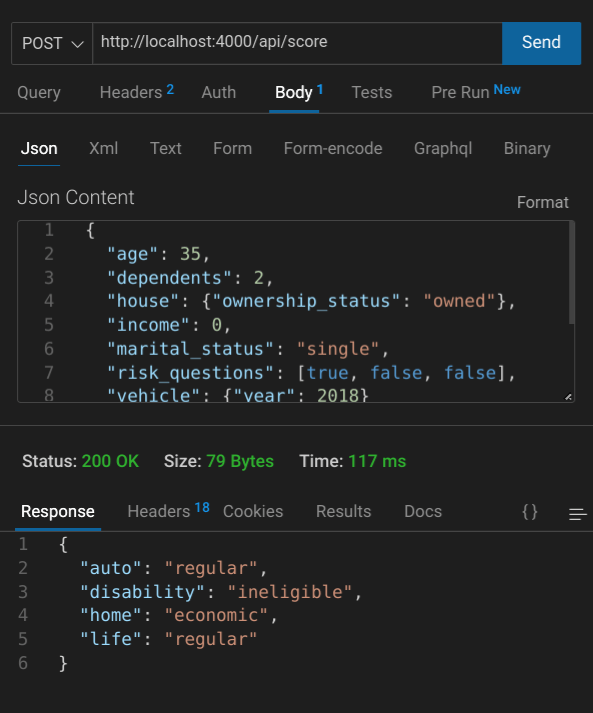
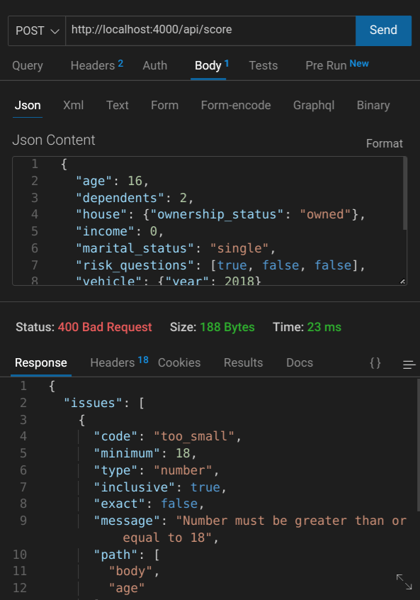
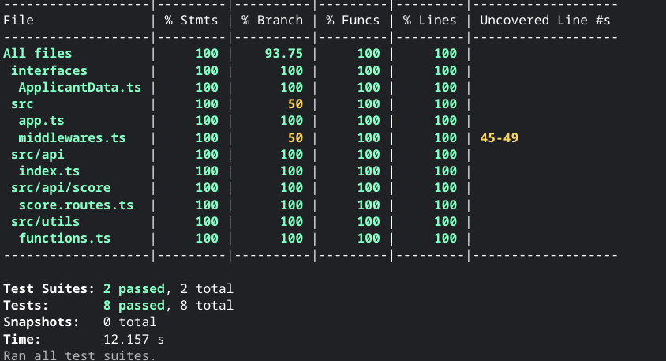

# Origin Backend Take-Home Assignment

This is solution to a previous version of Origin Financial's backend take home assignment [repo](https://github.com/OriginFinancial/origin-backend-take-home-assignment/tree/be22fc3e80c880e6d52e16c9ef481f2cd0f572b9).

## Screenshots



***



***



***

## Tasks

Origin offers its users an insurance package personalized to their specific needs without requiring the user to understand anything about insurance. This allows Origin to act as their *de facto* insurance advisor.

Origin determines the user’s insurance needs by asking personal & risk-related questions and gathering information about the user’s vehicle and house. Using this data, Origin determines their risk profile for **each** line of insurance and then suggests an insurance plan (`"economic"`, `"regular"`, `"responsible"`) corresponding to her risk profile.

For this assignment, you will create a simple version of that application by coding a simple API endpoint that receives a JSON payload with the user information and returns her risk profile (JSON again) – you don’t have to worry about the frontend of the application.

## The input
First, the would-be frontend of this application asks the user for her **personal information**. Then, it lets her add her **house** and **vehicle**. Finally, it asks her to answer 3 binary **risk questions**. The result produces a JSON payload, posted to the application’s API endpoint, like this example:

```JSON
{
  "age": 35,
  "dependents": 2,
  "house": {"ownership_status": "owned"},
  "income": 0,
  "marital_status": "married",
  "risk_questions": [0, 1, 0],
  "vehicle": {"year": 2018}
}
```

### User attributes
All user attributes are required:

- Age (an integer equal or greater than 0).
- The number of dependents (an integer equal or greater than 0).
- Income (an integer equal or greater than 0).
- Marital status (`"single"` or `"married"`).
- Risk answers (an array with 3 booleans).

### House
Users can have 0 or 1 house. When they do, it has just one attribute: `ownership_status`, which can be `"owned"` or `"mortgaged"`.

### Vehicle
Users can have 0 or 1 vehicle. When they do, it has just one attribute: a positive integer corresponding to the `year` it was manufactured.

## The risk algorithm
The application receives the JSON payload through the API endpoint and transforms it into a *risk profile* by calculating a *risk score* for each line of insurance (life, disability, home & auto) based on the information provided by the user.

First, it calculates the *base score* by summing the answers from the risk questions, resulting in a number ranging from 0 to 3. Then, it applies the following rules to determine a *risk score* for each line of insurance.

1. If the user doesn’t have income, vehicles or houses, she is ineligible for disability, auto, and home insurance, respectively.
2. If the user is over 60 years old, she is ineligible for disability and life insurance.
3. If the user is under 30 years old, deduct 2 risk points from all lines of insurance. If she is between 30 and 40 years old, deduct 1.
4. If her income is above $200k, deduct 1 risk point from all lines of insurance. 
5. If the user's house is mortgaged, add 1 risk point to her home score and add 1 risk point to her disability score. 
6. If the user has dependents, add 1 risk point to both the disability and life scores. 
7. If the user is married, add 1 risk point to the life score and remove 1 risk point from disability. 
8. If the user's vehicle was produced in the last 5 years, add 1 risk point to auto score.

This algorithm results in a final score for each line of insurance, which should be processed using the following ranges:

- **0 and below** maps to **“economic”**.
- **1 and 2** maps to **“regular”**.
- **3 and above** maps to **“responsible”**.


## The output
Considering the data provided above, the application should return the following JSON payload:

```JSON
{
    "auto": "regular",
    "disability": "ineligible",
    "home": "economic",
    "life": "regular"
}
```

## Criteria
You can choose any technology stack to implement this assignment. Using our stack is not a requirement in the selection process - we will consider exclusively that you build a solid system with an emphasis on code quality, simplicity, readability, maintainability, and reliability, particularly regarding architecture and testing to evaluate your work.

Be aware that Origin will mainly take into consideration the following evaluation criteria:
* How clean and organized your code is;
* If you implemented the business rules correctly;
* How good your automated tests are (qualitative over quantitative).

Other important notes:
* Develop a extensible score calculation engine
* Add to the README file: (1) instructions to run the code; (2) what were the main technical decisions you made; (3) relevant comments about your project 
* You must use English in your code and also in your docs

This assignment should be doable in less than one day. We expect you to learn fast, **communicate with us**, and make decisions regarding its implementation & scope to achieve the expected results on time.

It is not necessary to build the screens a user would interact with, however, as the API is intended to power a user-facing application, we expect the implementation to be as close as possible to what would be necessary in real-life. Consider another developer would get your project/repository to evolve and implement new features from exactly where you stopped. 

## Built With

- typescript
- express
- zod
- jest
- supertest

## Thoughts

- higher number - less risk
- Home ownership as boolean -> then further distinction
- Changed risk_questions to store true/false vs 0,1
- Age should be 18 or greater
- Summing the risk_questions - not specific enough - could go either way 
- Risk score can be negative
- False should be positive and true should be negative
- Made vehicle and house nullable - won't store 0 
- Used validation middleware
- Could add view on root route for documentation on api
- Some interface duplication because of middleware - wrapped Applicant in another object for the ApplicantData interface
- Logic for the score has some unnecessary calculations being performed since ineligibility is evaluated after the calculations are done
- Having earlier termination would require duplicated code
- The score being always calculated is a positive - the ineligibility rules can easily be changed.
- Of course, cors would be added with allowed origins for real api 

## How to Use

To clone and run this application, you'll need [Git](https://git-scm.com) and [Node.js](https://nodejs.org/en/download/) (which comes with [npm](http://npmjs.com)) installed on your computer. From your command line:

```bash
# Clone this repository & the companion backend repo
$ git clone https://jdegand.github.io/origin-backend-take-home-assignment

# Install dependencies
$ npm install

# Run 
$ npm start

# Test
$ npm test
```

## Useful Resources

- [YouTube](https://www.youtube.com/watch?v=QPE7L9b1bms) - express api with typescript
- [YouTube](https://www.youtube.com/watch?v=vDLE8hqzA8I) - CRUD API with typescript etc
- [Github](https://github.com/CodingGarden/intro-to-typescript/tree/examples/examples/express-api) - express api coding garden example
- [Github](https://github.com/colinhacks/zod/issues/149) - Zod tuples?
- [Github](https://github.com/Aquila169/zod-express-middleware) - zod express middleware
- [Dev.to](https://dev.to/franciscomendes10866/schema-validation-with-zod-and-expressjs-111p) - schema validation with zod and express
- [Github](https://github.com/colinhacks/zod/issues/1192) - Simple ZodObject inference from existing Interface?
